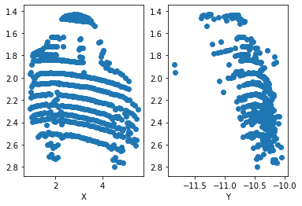
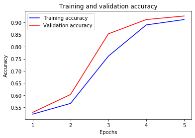
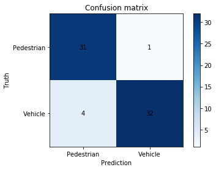
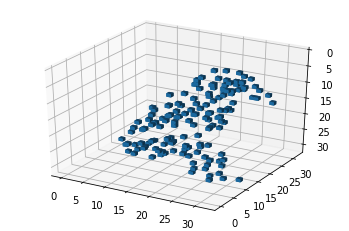
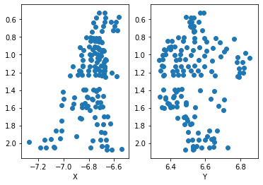
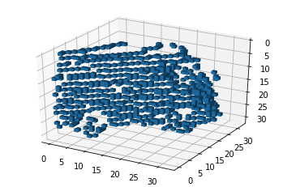
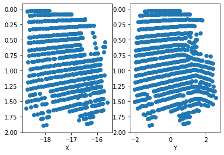
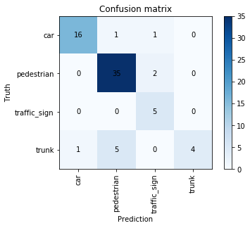

# Intro
This is a VoxNet implementation to classify 3D objects from LIDAR data. The method comes from 2015 [VoxNet: A 3D Convolutional Neural Network for real-time object recognition](https://www.ri.cmu.edu/pub_files/2015/9/voxnet_maturana_scherer_iros15.pdf) paper and the data comes from [Sydney Urban Object Dataset](http://www.acfr.usyd.edu.au/papers/SydneyUrbanObjectsDataset.shtml).

# Data
There are 26 classes from 631 samples, and the data is in point cloud format. Each instance has many (x,y,z) coordinates to represent the object. Here are some point cloud examples with their projections on X-Z and Y-Z planes:

Here is the instances distribution of the dataset:

The dataset is small and inbalanced. Some of the classes only have 1 instance, and many of the instances are from pedestrian and different vehicle types. As a result, I implemented binary classifier for pedestrian vs vehicle, and multiclass classifier for 4 most instances classes.

# VoxNet
Point cloud data is transformed into 32x32x32 voxel grid, and then traind by VoxNet CNN model. The point clouds become a fixed length 3D space data (32x32x32) after the transformation, and here is an example of the transformation:

The CNN model is a simple 2 layers of 3D convlution with max pooling and following by fully connected layers. Depending on if it's a binary classification of multiclass classification, the later layer activation function is sigmoid or softmax.

(Diagram from the [paper](https://www.ri.cmu.edu/pub_files/2015/9/voxnet_maturana_scherer_iros15.pdf))

# Binary classification results (vehicle vs pedestrian)
For binary classification, I combined 4wd, bus, car, truck, ute, and van data into vehicle class (188 instances), and classify them with pedestrian data (152 instances.) The data is shuffled and split into training and validation set (80%:20%). With 5 epochs, the accuracy for training set and validation set are 91% and 93%.

| Data | Accuracy |
|------|----------|
| Training | 91.2% |
| Validation | 92.7% |

From the confusion matrix, we can see that pedestrian class has higher chance of failure. Here are examples of misclssified instances:

- Pedestrian classified as vehicle

- Vehicle classified as pedestrian

# Multiclass classification results
I picked car, pedestrian, traffic_sign, and trunk from the data for multiclass classification because they are the classes with more than 50 instances.

| Class | Instances |
| - | - |
| car | 88 |
| pedestrian | 152 |
| traffic sign | 51 |
| trunk | 55 |

I trained the model with 10 epochs and the accuracies are 85% and 67% for training and validation set.

| Data | Accuracy |
|------|----------|
| Training | 83.7% |
| Validation | 85.7% |

We can see that trunk class performed worst among all the classes. Here are the validation set accuracies for each class.

| Class | Accuracy |
|------|----------|
| Car | 88.89% |
| Pedestrian | 94.59% |
| Traffic sign | 100% |
| Trunk | 40% |

# 23 classes
I also tried to classify 23 classes (removed 3 classes that only contain 1 instance) and the result wasn't good. It's most likely caused by small dataset and inbalanced data.

| Data | Accuracy |
|------|----------|
| Training | 62.75% |
| Validation | 47.62% |

# Final thoughs
VoxNet is a straightforward approach to utilize neural network on 3D data. However, 32x32x32 voxel grids lose granularities. This dataset is also very limited. I would like to try VoxNet on more complicated dataset and some other more models that uses point cloud data directly, such as PointNet.
