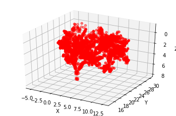

# Intro
I implemented VoxNet to classify 3D objects from LIDAR data. The method comes from 2015 [VoxNet: A 3D Convolutional Neural Network for real-time object recognition](https://www.ri.cmu.edu/pub_files/2015/9/voxnet_maturana_scherer_iros15.pdf) paper and the data comes from [Sydney Urban Object Dataset](http://www.acfr.usyd.edu.au/papers/SydneyUrbanObjectsDataset.shtml).

# Data
There are 26 classes from 631 samples, and the data is in point cloud format. Basically, each sample has a bunch of (x,y,z) coordinates to represent the object. Here are some examples:

These are the 26 classes and the instances distribution of them:

The dataset is small and inbalanced. Some of the classes only have 1 instance, and majority of the instances are from pedestrian and different vehicle types. As a result, I implemented binary classifier of pedestrian vs vehicle, and multiclass classifier for 5 most instances count classes.

# VoxNet
Point cloud data is transformed into 32x32x32 voxel grid, and the VoxNet CNN model is trained using voxel grid data. Here is an example of a instance after the transformation:

The CNN model is a simple 2 3D convlution layers with max pooling and followed by fully connected layers. Depending on if it's binary classification of multiclass classification, the activation function of the last layer is sigmoid or softmax.

# Binary classification results (vehicle vs pedestrian)

